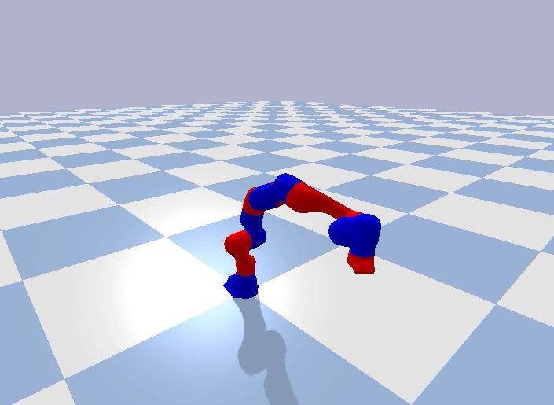
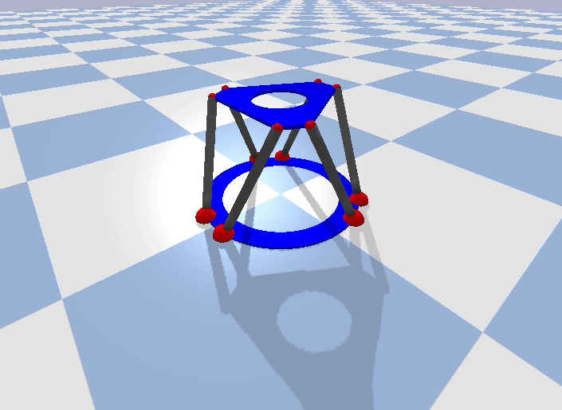

# Physics Interface
The repository contains a shared memory with semaphore synchronization interface to simulate any physical system. The semaphore used as a named semaphore called "physics_sem" while the shared memory's name is "physics_shm". The underlying physics engine is based on bullet3 from https://github.com/bulletphysics/bullet3

## Build instructions
The repository can be cloned and built using the following commands

    git clone https://github.com/xyyeh/physics_interface.git
    mkdir build
    cd build
    cmake .. -DCMAKE_BUILD_TYPE=Release -DBUILD_THIRDPARTY=ON

This updates the existing app_simulation folder with the new robot system defined in thirdparty/bullet3/examples/RobotSimulatorShm folder. Note that the required mesh files need to be made available. An example is given in the app_simulation folder for a Franka Emika's panda manipulator

## Parallel kinematics
Since some robots are designed with closed loop chains, an example of a 6-SPS manipulator is also provided. The addConstraint function in bullet is used to enforce the constraints at the legs and thus limits the moving platform to 6 DOFs.

## Usage
1. To change the view port, simply hold the ALT or CONTROL key, you have Maya style camera mouse controls.
Press F1 to create a series of screenshots. Hit ESCAPE to exit the demo app.
2. To interact with the robot using a controller, include the control code in the app_control folder. A shared memory header only library is provided. Simply include that in your application
